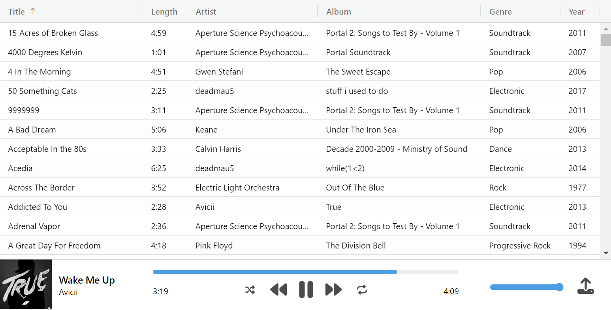

# gabagoo: javascript music player demo

A small demo of a browser-based music player using the File System API, featuring:

- Support for ID3 and iTunes metadata
- Album art display
- Ability to show/hide specific columns by right clicking header
- MediaSession support allowing the use of system playback controls

(Check out [Aria](https://github.com/aria-player/aria) for a fully featured cross-platform music player which evolved from this demo!)

## Building and running

1. Clone and run `bun install` in this directory

2. Run `bun run build` to build the app

3. Open index.html.

Alternatively, run `bun dev` to watch for code changes and rebuild automatically.

## Usage

To add tracks to the library, click the 'upload' button in the bottom right. Pick a folder containing music (or containing subfolders with music in them) and the library will populate.

Once you have loaded your music library, double-click any track to start playback.

Because of the way the File System API works, you have to re-select your library folder each time you reload the page. However, it will scan much faster when re-loading the library since metadata gets cached in IndexedDB.
